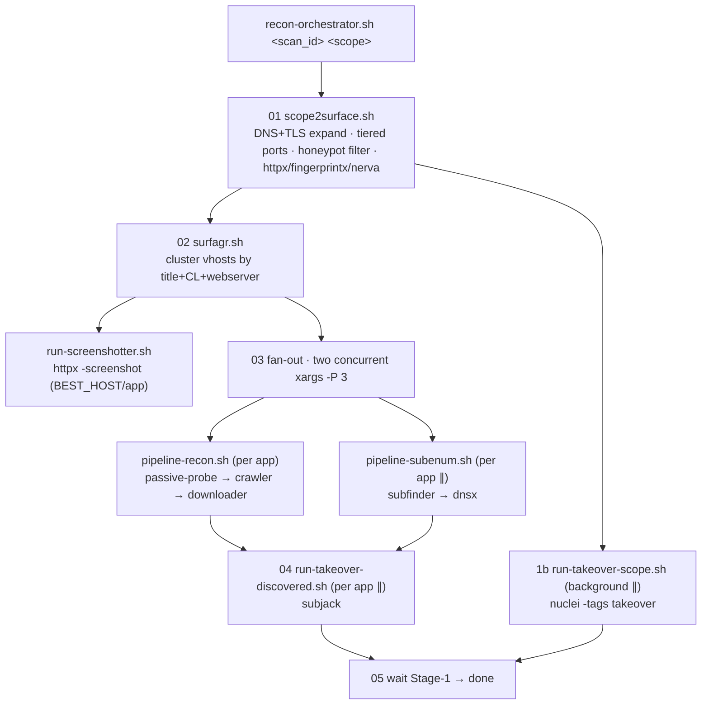

# Recon Pipeline — flow & commands

Reconnaissance-to-takeover toolkit. From a raw scope (IPs, domains, wildcards) to
subdomain-takeover detection. Every node is a worker script; each worker also runs
standalone via a positional arg **or** stdin. Top-level driver: `recon-orchestrator.sh`.

Scripts live in `utils/recon/`. Engagement output is staged under `./scans/<scan_id>/`.

```
scope → surface → cluster + screenshot → per-app (recon ∥ subenum) → takeover
```

## DAG



**Concurrency**

- `1b` `run-takeover-scope.sh` starts with `&` right after `scope2surface` and runs in the
  background for the whole rest of the pipeline; joined at the end.
- `03` two `xargs -P 3` sweeps run **concurrently**: `pipeline-recon.sh` and
  `pipeline-subenum.sh`, each processing 3 apps at a time. A `wait` barrier follows.
- `04` `run-takeover-discovered.sh` is launched per app with `&` then `wait`.

---

## 00 — Entry point

```bash
recon-orchestrator.sh <scan_id> <scope_file>
BASE=./scans/<scan_id>; mkdir -p "$BASE"; cp <scope_file> "$BASE/scope.txt"
```

## 01 — scope2surface.sh — attack surface

`scope2surface.sh "$BASE/scope.txt" "$BASE/att_surface"`
Expands scope via DNS + TLS certs, tiered port scan, honeypot filter, multi-engine fingerprint.

**Discovery** — URL→domain, CIDR, SAN/CN from TLS, reverse PTR, wildcards:

```bash
grep -E '^https?://' scope_init.txt | anew scope_urls.txt | unfurl domain | anew scope_dns.txt
grep -E '<ip/cidr>'  scope_init.txt | mapcidr -silent | anew scope_ip.txt
cat scope_ip.txt | naabu -silent -top-ports 1000 -exclude-cdn -c 50 -rate 1000 \
  | tlsx -san -cn -silent -resp-only | anew tlsx_raw.txt | dnsx -silent | anew scope_dns.txt
cat scope_ip.txt | dnsx -ptr -resp-only -silent | anew scope_dns.txt \
  | tlsx -san -cn -silent -resp-only | anew tlsx_raw.txt | dnsx -silent | anew scope_dns.txt
echo "$wildcard" | assetfinder -subs-only | anew scope_dns.txt
echo "$wildcard" | subfinder -silent       | anew scope_dns.txt
```

**Resolve + wildcard filter** → canonical lists:

```bash
cat scope_dns.txt | shuffledns -mode resolve -sw -silent -r /opt/resolvers/resolvers-trusted.txt \
  | anew scans/subdomains.txt
cat subdomains.txt tlsx_raw.txt | dnsx -a -resp-only -silent | anew unique_ips.txt
cat subdomains.txt tlsx_raw.txt | dnsx -a -resp -nc -silent -o domain_ip_map.txt
```

**Tiered port scan + honeypot filter** (drop IPs with ≥15 open ports, then full-scan the safe ones):

```bash
cat unique_ips.txt | naabu -exclude-cdn -tp 1000 -silent -cdn -o naabu_1k_results.txt
cut -d: -f1 naabu_1k_results.txt | sort | uniq -c \
  | awk '$1<15 {print $2}'  > valid_ips.txt                          # safe → automation
  # awk '$1>=15 {print $2}' > targets/high_port_number_manual_review.txt   # honeypot/tarpit
cat valid_ips.txt | naabu -exclude-cdn -tp full -silent -cdn -o naabu_full_results.txt
```

**Fingerprinting** — httpx (web metadata) + fingerprintx + nerva (services):

```bash
cat tlsx_raw subdomains naabu_full high_port_review | cut -d' ' -f1 \
  | httpx -silent -sc -cl -td -title -ip -hash sha256 -location -fr -j -o httpx_full_metadata.jsonl
cat naabu_full_results.txt | cut -d' ' -f1 | fingerprintx --json | anew fingerprintx_full_metadata.jsonl
cat naabu_full_results.txt | cut -d' ' -f1 | nerva       --json | anew nerva_full_metadata.jsonl
cat httpx_full_metadata.jsonl \
  | jq -s 'unique_by(.title+(.content_length|tostring)+.webserver)|.[].url' \
  | cut -d'"' -f2 | anew targets/unique_webapps.txt
```

**Outputs:** `scans/subdomains.txt`, `scans/httpx_full_metadata.jsonl`, `scans/unique_ips.txt`,
`targets/unique_webapps.txt`, `targets/high_port_number_manual_review.txt`

## 1b — run-takeover-scope.sh — Stage 1 takeover (background ∥)

```bash
nuclei -l subdomains.txt -tags takeover -j -silent -duc -o "$BASE/takeovers_scope.jsonl"
```

**Outputs:** `takeovers_scope.jsonl`

## 02 — surfagr.sh — cluster apps

`surfagr.sh "$BASE/att_surface/scans/httpx_full_metadata.jsonl" "$BASE/apps"`
Groups vhosts by *Title + Content-Length + Webserver* into per-app dirs, then screenshots.

```bash
cat httpx_full_metadata.jsonl \
  | jq -s -c 'group_by(.title+(.content_length|tostring)+.webserver)|.[]' > app_groups.jsonl
# per group → dir  apps/targets/<rep_host>_<safe_title>/
jq -r '.[].url' | sort -u > hosts.txt
jq -r '.[0] | "Title/IP/Webserver/Tech/Content-Length/Status-Code"' > info.txt
```

**Outputs:** `apps/targets/<host>_<title>/{hosts.txt, info.txt}`

### run-screenshotter.sh (invoked by surfagr)

One `httpx -screenshot` pass on the BEST_HOST (non-IP preferred) of each cluster; distributes
PNGs as `screenshot.png` / `screenshot.failed` per app for parallel visual triage.

```bash
httpx -l best_hosts.txt -screenshot -system-chrome -screenshot-timeout 15 \
  -exclude-screenshot-bytes -no-screenshot-full-page -silent -j -o shots.jsonl
```

**Outputs:** `<app>/screenshot.png` | `<app>/screenshot.failed`

## 03 — per-app fan-out

Two **concurrent** sweeps, then a `wait` barrier:

```bash
find apps/targets -mindepth 1 -maxdepth 1 -type d | xargs -P 3 -I{} pipeline-recon.sh   {} &
find apps/targets -mindepth 1 -maxdepth 1 -type d | xargs -P 3 -I{} pipeline-subenum.sh {} &
wait
```

### pipeline-recon.sh (per app — sequential 1→2→3)

```bash
# 1. Passive OSINT — run-passive-probe.sh (gau ∥ urlfinder)
cat hosts.txt | gau --threads 5            &
urlfinder -list hosts.txt -t 5 -silent -all &
wait; sort -u > osint_urls.txt

# 2. Active crawl — run-crawler.sh (classify SPA vs static via httpx, then Katana)
httpx -l targets -silent -td -j          # SPA if tech ~ react|vue|angular|svelte|next|nuxt|gatsby
katana -silent -s breadth-first -list std -d 3 -ct 2 -jc -kf all -j            # static
katana -silent -s breadth-first -list spa -headless -d 3 -ct 2 -jc -kf all -j  # SPA
# → crawled_urls.txt / crawled_urls.jsonl

# 3. Merge + noise filter + download — run-downloader.sh
cat osint_urls.txt crawled_urls.txt | sort -u > all_endpoints_raw.txt
grep -viE '\.(jpg|jpeg|png|gif|svg|...|css|mp4|webm)($|\?)' all_endpoints_raw.txt > all_endpoints_clean.txt
grep -ivE '\.js($|\?)' all_endpoints_clean.txt \
  | httpx -silent -srd html -sc -cl -ct -location -title -server -td -lc -wc -o httpx.txt
grep -iE '\.js($|\?)' all_endpoints_clean.txt | xargs -I% -P10 wget -q -x -nH -P js %
```

**Outputs:** `all_endpoints_clean.txt`, `html/`, `js/`

### pipeline-subenum.sh (per app — ∥ with recon)

```bash
unfurl format %d < hosts.txt | sort -u > domains.txt
subfinder -dL domains.txt -silent | dnsx -silent | sort -u > discovered_subs.txt
```

**Outputs:** `discovered_subs.txt`

## 04 — run-takeover-discovered.sh — Stage 2 takeover (per app ∥)

Union of hosts from `all_endpoints_clean.txt` + `discovered_subs.txt`, then subjack
(signatures complement Stage 1's nuclei).

```bash
{ unfurl format %d < all_endpoints_clean.txt; cat discovered_subs.txt; } | sort -u > hosts
subjack -w hosts -t 100 -ssl -timeout 30 -o takeover.txt
```

> ⚠ subjack prints a `[Not Vulnerable]` line per host — filter at triage time
> (`grep -v "Not Vulnerable" takeover.txt`).

**Outputs:** `<app>/takeover.txt`

## 05 — join

Orchestrator does `wait $TAKEOVER_SCOPE_PID` (Stage 1, usually already done) and exits.
Full engagement under `./scans/<scan_id>/`.

---

## Alternative orchestrator — Dagu

Same topology, different engine. `orchestration/dagu/recon.yaml` (parent) +
`app.yaml` (child per `APP_ID`) reproduce the DAG above via thin adapters in `adapters/`.

- Parent: `scaffold → scope2surface → (takeover-scope ∥ surfagr → screenshotter) → enumerate → per-app`.
  The `per-app` step is `action: dag.run` with `parallel.max_concurrent: 3` (= the two `xargs -P 3`).
- Child `app.yaml`: `recon ∥ subenum → takeover-discovered`.

## Helpers outside the pipeline

- **find-dirb.sh** (standalone) — recursive dirbust of a single host, conservative rate limit:
  ```bash
  feroxbuster --url https://<host> -A --depth 3 --filter-status 404 \
    --rate-limit 25 --threads 10 --wordlist .../Web-Content/common.txt
  ```
- **run-web-sast.sh** (orphan — not called by any pipeline) — regex secret/endpoint hunter over `js/`:
  ```bash
  grep -HnEor 'AKIA…|sk_live_…|AIza…|eyJ…|xox[baprs]-…' js/   # secrets
  grep -Eor '"(/path)+"' js/                                  # hidden endpoints
  ```
- **pipeline-local-discovery.sh** (orphan) — half-finished refactor of `pipeline-recon.sh`.

I/O and workspace conventions for new/modified workers: see `CONVENTIONS.md`.
